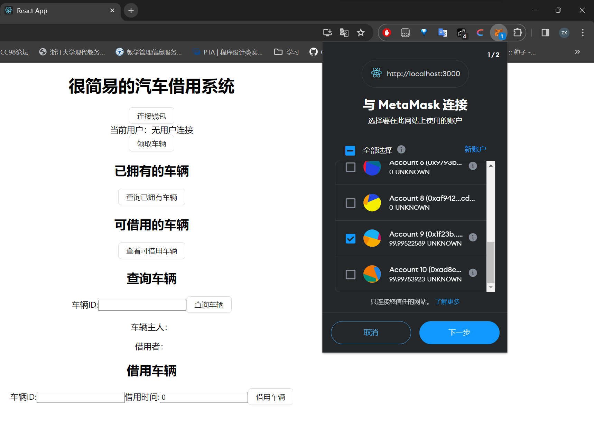
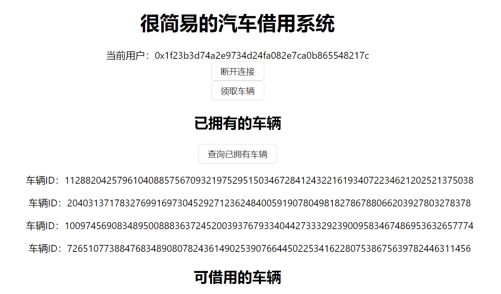
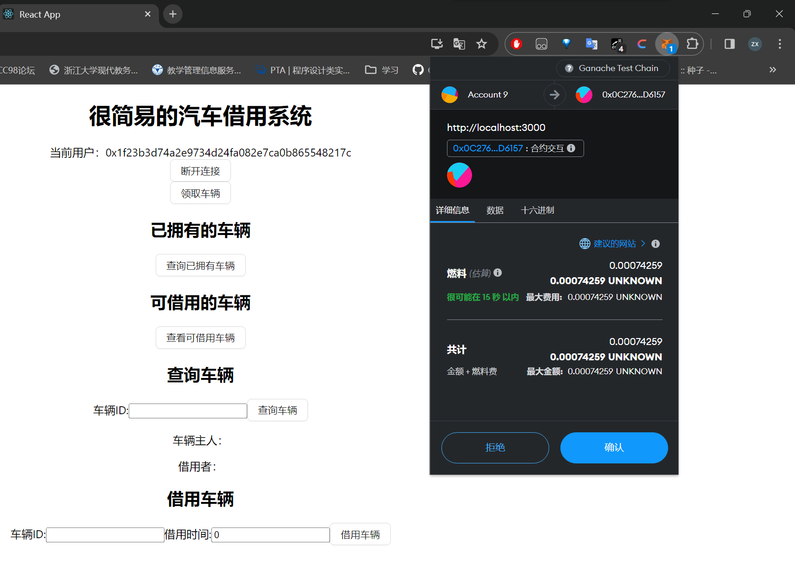
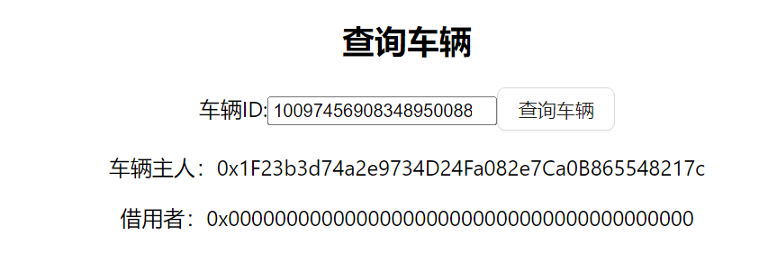
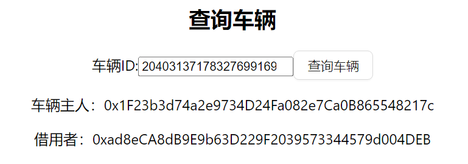
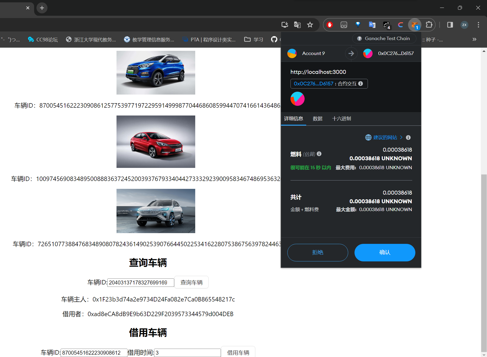

# ZJU-blockchain-course-2023

⬆ 可以️修改成你自己的项目名。

> 第二次作业要求（以下内容提交时可以删除）：
> 
> 简易汽车借用系统，参与方包括：汽车拥有者，有借用汽车需求的用户
>
> 背景：ERC-4907 基于 ERC-721 做了简单的优化和补充，允许用户对NFT进行租借。
> - 创建一个合约，在合约中发行NFT集合，每个NFT代表一辆汽车。给部分用户测试领取部分汽车NFT，用于后面的测试。
> - 在网站中，默认每个用户的汽车都可以被借用。每个用户可以： 
>    1. 查看自己拥有的汽车列表。查看当前还没有被借用的汽车列表。
>    2. 查询一辆汽车的主人，以及该汽车当前的借用者（如果有）。
>    3. 选择并借用某辆还没有被借用的汽车一定时间。
>    4. 上述过程中借用不需要进行付费。
> 
> - （Bonus）使用自己发行的积分（ERC20）完成付费租赁汽车的流程
> - 请大家专注于功能实现，网站UI美观程度不纳入评分标准，但要让用户能够舒适操作。简便起见，可以在网上找图片代表不同汽车，不需要将图片在链上进行存储。

**以下内容为作业仓库的README.md中需要描述的内容。请根据自己的需要进行修改并提交。**

作业提交方式为：**提交视频文件**和**仓库的链接**到指定邮箱。

## 如何运行

补充如何完整运行你的应用。

1. 在本地启动ganache应用。
2. 在 `./contracts` 中安装需要的依赖，运行如下的命令：
    ```bash
    npm install
    ```
3. 在 `./contracts` 中编译合约，运行如下的命令：
    ```bash
    npx hardhat compile
    ```
4. 在ganache中创建新的workspace，修改端口为http://127.0.0.1:8545
5. 在 `./frontend` 中安装需要的依赖，运行如下的命令：
    ```bash
    npm install
    ```
6. 在 `./frontend` 中启动前端程序，运行如下的命令：
    ```bash
    npm run start
    ```


## 功能实现分析

简单描述：项目完成了要求的哪些功能？每个功能具体是如何实现的？
0. 数据存储
    创建了很多数组来存储各种信息。
1. 连接钱包
    用了彩票demo里提供的代码段。
2. 发行汽车NFT
    单击“领取车辆”即可创建一个ERC721代币到当前账户上。为方便演示没有设置上限。
    使用keccak256()生成随机散列作为tokenId，再使用_safeMint()接口来创建NFT，更新几个数组。
3. 查询已拥有的车辆
    直接返回数组。
4. 查询可借用的车辆
    直接返回数组*2
5. 查询车辆
    输入车辆的tokenId，直接返回车辆的主人和借用者。如果车辆没有被借用，借用者就返回全0地址。
6. 借车
    输入tokenId和借用时间，若符合要求则修改车辆的借用者，并将其从可借用车辆中移除。
    由于solidity没有提供直接移除某个指定值的函数，所以写了一个removeByValue来方便把被借用车从可接车数组中移除，其中调用了pop()来避免出现空值。


## 项目运行截图
1. 连接钱包

2. 领取车辆

3. 查询已拥有车辆

4. 查询可借用车辆

5. 查询某一辆车


6. 借用车辆



## 参考内容

- 课程的参考Demo见：[DEMOs](https://github.com/LBruyne/blockchain-course-demos)。

- ERC-4907 [参考实现](https://eips.ethereum.org/EIPS/eip-4907)

如果有其它参考的内容，也请在这里陈列。
